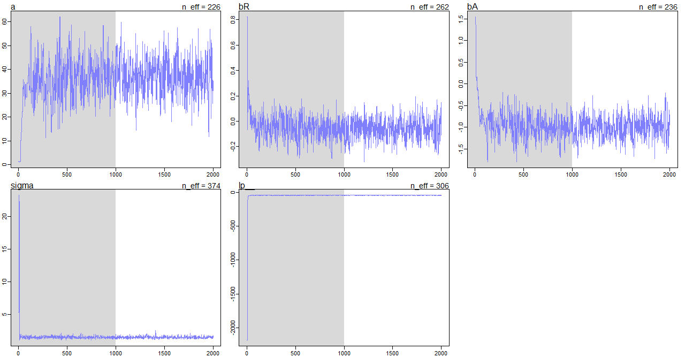
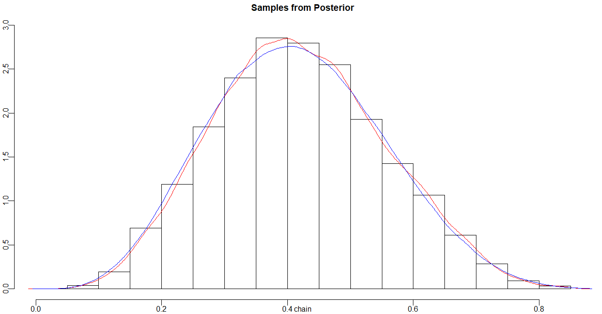
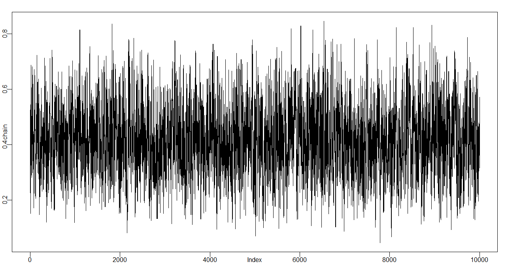
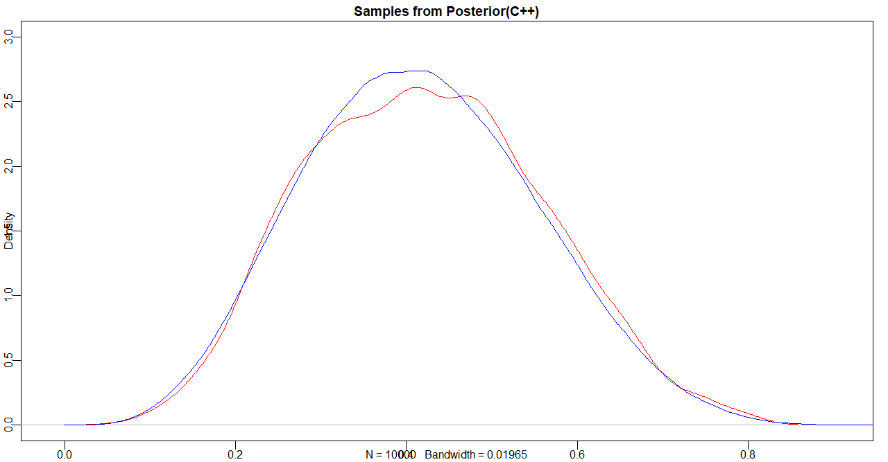
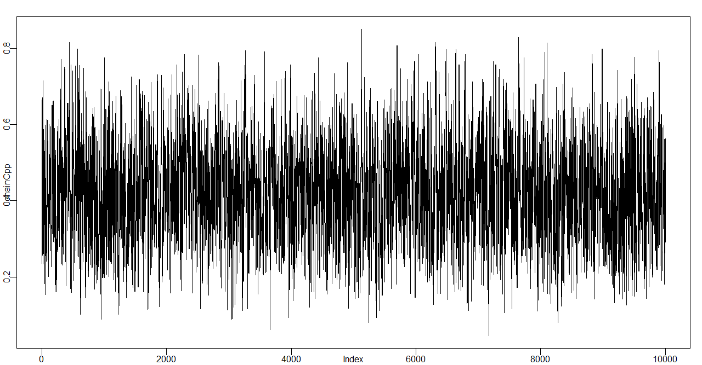
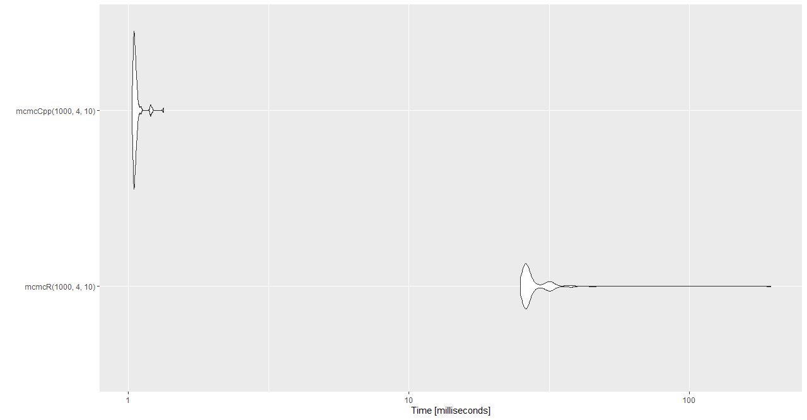

# MCMC for Forensic Science - Solutions

## Easy

```R
library("seqinr")
fsa_data <- read.abif("A04_RD14-0003-23d3d-0.0078IP-Q2.5_001.5sec.fsa")
plotabif(fsa_data)
```

## Medium

```R
rm(list=ls())
library("seqinr")
fsa_data <- read.abif("A04_RD14-0003-23d3d-0.0078IP-Q2.5_001.5sec.fsa")
tscale = 1000
tmin = 1/tscale
tmax = fsa_data$Data[["SCAN.1"]]/tscale
irange = (tmin*tscale):(tmax*tscale)
x = irange/tscale

chanel.names = c(1:4,105)

temp <- data.frame()
for(i in 1:5)
{
  chanel = i
  DATA = paste("DATA", chanel.names[chanel], sep = ".")
  yscale = 1000
  y = fsa_data$Data[[DATA]][irange]/yscale
  
  data_label = sapply(rep(DATA, length(fsa_data$Data[[DATA]])), c) # 9335
  
  temp <- rbind(temp, data.frame(x, y, data_label))
}

library(ggplot2)
ggplot(temp, aes(x, y)) + geom_line() + facet_grid(data_label~.)
```


## Hard

### Multivariate regression (lm)
Here we are performing multivariate regression using the WaffleDivorce dataset from rethinking package.

```R
rm(list=ls())
library(rethinking)
data(WaffleDivorce)
d <- WaffleDivorce
d <- d[ , c("Divorce","MedianAgeMarriage","Marriage") ] 

summary(lm(Divorce ~ MedianAgeMarriage + Marriage, data=d))
```
Here we can see the estimation of the regression coefficients, and we can see the Median Age of Marriage is an important predictor in predicting Divorce rate.

```console
Coefficients:
                  Estimate Std. Error t value Pr(>|t|)    
(Intercept)       36.87665    7.66104   4.814 1.58e-05 ***
MedianAgeMarriage -0.99965    0.24593  -4.065 0.000182 ***
Marriage          -0.05686    0.08053  -0.706 0.483594    
```
### Bayesian Multivariate regression (rStan)
Now, if we have prior knowledge about the parameters we are estimating, we have to use Bayesian statistics. We perform another multivariate regression using priors over all parameters. We will use the **rStan** package. We will write our model, and rStan will convert it to a model that Stan model.

```R
model <- map2stan( 
  alist(
    Divorce ~ dnorm( mu , sigma ) ,
    mu <- a + bA*MedianAgeMarriage + bR*Marriage ,
    a ~ dnorm(0,100),
    bR ~ dnorm(0,10),
    bA ~ dnorm(0,10),
    sigma ~ dcauchy(0,2)
  ) ,
  data=d )
precis(model)
```
Here we can see that parameter estimates are very similar to what we found with our lm function because our priors has large standard devaition.
```console
       mean   sd  5.5% 94.5% n_eff Rhat4
a     37.02 7.53 25.12 48.40   226     1
bR    -0.06 0.08 -0.19  0.07   262     1
bA    -1.00 0.24 -1.38 -0.62   236     1
sigma  1.52 0.16  1.29  1.77   374     1
```
Internally, Stan is using MCMC method to sample parameter from each of the posterior. We need to investigate the trace plot of each parameter to check if the Markov Chain was staionary.



### MCMC HM Sampler(in R)
Here is a MCMC HM samplers in R.

```R
rm(list=ls())
library(raster)

mcmcR <- function(samples, success, trials){
  n <- samples
  chain <- sapply(rep(NA, n), c)
  chain[1] <- 0.5
  for(x in 2:n){
    nextState <- rnorm(1, chain[x-1], sd = 0.16) # Monte Carlo
    
    # estimate coin toss p
    # dbeta(1,1) Almost uniform prior
    # dbinom(4, 10) 4 heads our of 10 tosses
    # Metropolis-Hasting Step
    likelihood_ratio <- 
      (dbeta(nextState,1,1) * dbinom(x=success,size=trials,prob=clamp(nextState,0,1)))/
      (dbeta(chain[x-1],1,1) * dbinom(x=success,size=trials,prob=clamp(chain[x-1],0,1)))
    
    acceptance_prob <- min(likelihood_ratio, 1)
    if(acceptance_prob == 1){
      chain[x] = nextState
    } else if(acceptance_prob > runif(1)){
      chain[x] = nextState
    } else {
      chain[x] = chain[x-1]
    }
  }
  return(chain)
}
```
Here we see the histogram, and kernel density estimation(in red) using the samples generated by our mcmcR function. The blue is the beta(5, 7) which is the analystical solution.


Here is also the trace plot to demontstrae our samples can attain staionarity.


### MCMC HM Sampler(in C++)
Now lets see how can we speed up the sampling process using a C++ implementation. Here we can see the our C++ sampler also reach stationary,

```Cpp
#include <Rcpp.h>
#include <cmath>
using namespace Rcpp;

// [[Rcpp::export]]
NumericVector mcmcCpp(int length, int success, int trials) {
  NumericVector chain(length);
  
  chain[0] = 0.5;

  for(int x = 1; x<length; x++){
    double nextState = rnorm(1, chain[x-1], 0.16)[0];

    double numvalue = nextState;
    numvalue = numvalue<0.001?0.001:numvalue;
    numvalue = numvalue>0.999?0.999:numvalue;

    double numerator = R::dbeta(nextState, 1, 1, false) * R::dbinom(success, trials, numvalue, false);
    double denumerator = R::dbeta(chain[x-1], 1, 1, false) * R::dbinom(success, trials, chain[x-1], false);
    double likelihood_ratio = numerator / denumerator;
    
    double acceptance_prob = std::min(1.0, likelihood_ratio);
    if( acceptance_prob == 1.0){
      chain[x] = nextState;
    }else if(acceptance_prob > Rcpp::runif(1)[0]){
      chain[x] = nextState;
    }else{
      chain[x] = chain[x-1];
    }
  }
  return chain;
}
```
Now calling the function from R,

```R
chainCpp <- mcmcCpp(10000, 4, 10)
plot(chainCpp, type="l")
```



### Difference in performance
Lets look at the performance difference between this two implementation
```R
library(microbenchmark)
library(ggplot2)
benchmark_result <- microbenchmark(mcmcR(10000, 4, 10), mcmcCpp(10000, 4, 10))
ggplot2::autoplot(benchmark_result)
```


Here we can see the the C++ implements outperforms R implementation.
