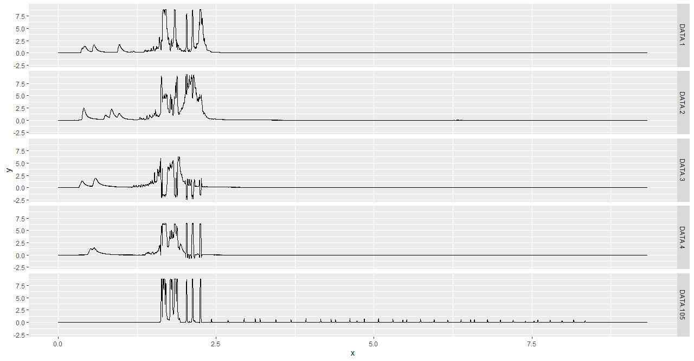

# MCMC for Forensic Science - Solutions

### Easy: download data from https://lftdi.camden.rutgers.edu/provedit/files/ then use seqinr::read.abif to read and seqinr::plotabif to plot an fsa file.

```R
library("seqinr")
fsa_data <- read.abif("A04_RD14-0003-23d3d-0.0078IP-Q2.5_001.5sec.fsa")
plotabif(fsa_data)
```

### Medium: make a similar multi-panel ggplot with facet_grid.

```R
rm(list=ls())
library("seqinr")
fsa_data <- read.abif("A04_RD14-0003-23d3d-0.0078IP-Q2.5_001.5sec.fsa")
tscale = 1000
tmin = 1/tscale
tmax = fsa_data$Data[["SCAN.1"]]/tscale
irange = (tmin*tscale):(tmax*tscale)
x = irange/tscale

chanel.names = c(1:4,105)

temp <- data.frame()
for(i in 1:5)
{
  chanel = i
  DATA = paste("DATA", chanel.names[chanel], sep = ".")
  yscale = 1000
  y = fsa_data$Data[[DATA]][irange]/yscale
  
  data_label = sapply(rep(DATA, length(fsa_data$Data[[DATA]])), c) # 9335
  
  temp <- rbind(temp, data.frame(x, y, data_label))
}

library(ggplot2)
ggplot(temp, aes(x, y)) + geom_line() + facet_grid(data_label~.)
```



### Hard: Demonstrate your capability in one of the "Bayesian packages for general model fitting" listed here: https://cloud.r-project.org/web/views/Bayesian.html, or in writing an R package with C++ code.
