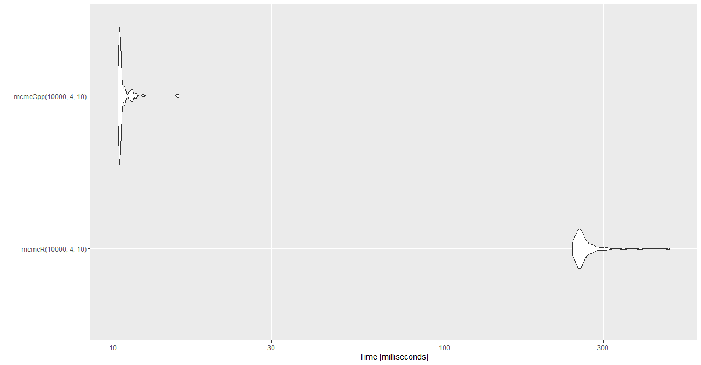

# MCMC for Forensic Science - Solutions

## Easy

```R
library("seqinr")
fsa_data <- read.abif("A04_RD14-0003-23d3d-0.0078IP-Q2.5_001.5sec.fsa")
plotabif(fsa_data)
```


## Medium

```R
rm(list=ls())
library("seqinr")
fsa_data <- read.abif("A04_RD14-0003-23d3d-0.0078IP-Q2.5_001.5sec.fsa")
tscale = 1000
tmin = 1/tscale
tmax = fsa_data$Data[["SCAN.1"]]/tscale
irange = (tmin*tscale):(tmax*tscale)
x = irange/tscale

chanel.names = c(1:4,105)

temp <- data.frame()
for(i in 1:5)
{
  chanel = i
  DATA = paste("DATA", chanel.names[chanel], sep = ".")
  yscale = 1000
  y = fsa_data$Data[[DATA]][irange]/yscale
  
  data_label = sapply(rep(DATA, length(fsa_data$Data[[DATA]])), c) # 9335
  
  temp <- rbind(temp, data.frame(x, y, data_label))
}

library(ggplot2)
ggplot(temp, aes(x, y)) + geom_line() + facet_grid(data_label~.)
```


## Hard

For the hard problem I chose to use the rStan package. This package converts models specified in R into Stan model. We will start by running a multivariate linear regression on WaffleHouse dataset where we would estimate the regression coefficient when regressing Divorce on Median age and Marriage rate using lm() function. Then we will estimate those coefficients again using rStan given we have a prior knowledge our problem. 

Stan uses Markov chain Monte Carlo(MCMC) to collect sample from the posteior of the regression coefficients. We will reimplmeemnt MCMC Metropolis–Hastings algorithm algorithm in R to demonestrate how the algorithm works. Afterwards we will reimplement it in C++ for better performance. Finally we will run benchmark to see the improvement in performance.

Jump to content:
1. [Regression using lm](#regression-using-lm)
2. [Regression using rStan](#regression-using-rstan)
3. [MCMC HM Implementation in R mcmcR](#mcmc-hm-implementation-in-r-mcmcr)
4. [MCMC HM Implementation in Cpp mcmcCpp](#mcmc-hm-implementation-in-cpp-mcmccpp)
5. [Benchmark between mcmcR mcmcCpp](#benchmark-between-mcmcr-mcmccpp)

### Regression using lm

Here we are regressing Divorce on Marriage median age and Marriage rate. When using lm function we are assuming uniform prior distribution on the parameter of interest.

```R
rm(list=ls())
library(rethinking)
data(WaffleDivorce)
d <- WaffleDivorce
d <- d[ , c("Divorce","MedianAgeMarriage","Marriage") ] 

summary(lm(Divorce ~ MedianAgeMarriage + Marriage, data=d))
```
Here is the summery of the fitted model, and here we can see that the values of the regression coefficient and their standard error. We can see the Median Age is an important predictor in predicting Divorce rate.

```console
Coefficients:
                  Estimate Std. Error t value Pr(>|t|)    
(Intercept)       36.87665    7.66104   4.814 1.58e-05 ***
MedianAgeMarriage -0.99965    0.24593  -4.065 0.000182 ***
Marriage          -0.05686    0.08053  -0.706 0.483594    
```
### Regression using rStan
Now, if we have prior knowledge about the parameters we are estimating and we will use rStan to encode that information before estimating the coefficients again. We will specifiy the model with its prior in R but rStan converts it to a Stan mode.

```R
model <- map2stan( 
  alist(
    Divorce ~ dnorm( mu , sigma ) ,
    mu <- a + bA*MedianAgeMarriage + bR*Marriage ,
    a ~ dnorm(0,100),
    bR ~ dnorm(0,10),
    bA ~ dnorm(0,10),
    sigma ~ dcauchy(0,2)
  ) ,
  data=d )
precis(model)
```
Here is the summary of the fitted model, and we can see that the values of the coefficients are almost equal to our previous analysis. One of the reason they are equal is because our priors have large standard deviation therefore not very strong to sway the estimates.

```console
       mean   sd  5.5% 94.5% n_eff Rhat4
a     37.02 7.53 25.12 48.40   226     1
bR    -0.06 0.08 -0.19  0.07   262     1
bA    -1.00 0.24 -1.38 -0.62   236     1
sigma  1.52 0.16  1.29  1.77   374     1
```
But how Stan is estimating the paramter? It is using MCMC method. It is a sampling algorithm. To validate the Markon chains generated during the model fitting - we need to check if the chain is stationary. In the following figure we see that the once the parameter values are stable, they are not deviating too much from the mean therefore making our chain stable.


### MCMC HM Implementation in R mcmcR
But how does the MCMC sampling works? Here we will demonestrate how it work by reimplmenting it in R. We will work with a different problem. Lets say in sequence of 10 coin tosses we get 4 head. What is the distribution of probability of head(p) given the event we've just observed.

Here the likelihood function is binomial with parameter value of 4 and 10. Prior of p follows beta distribution with 1 and 1 as shape parameters. We need to find the posterior distribution of p given we've oberved 4 heads out of 10 coin tosses.

The following function, **mcmcR** takes 3 parameters. First one is the number of samples we want to sample from our posteiror, second one is the number of coin tosses results in head and the final one is the number of trials. 

```R
rm(list=ls())
library(raster)

mcmcR <- function(samples, success, trials){
  n <- samples
  chain <- sapply(rep(NA, n), c)
  chain[1] <- 0.5
  for(x in 2:n){
    nextState <- rnorm(1, chain[x-1], sd = 0.16) # Monte Carlo
    
    # estimate coin toss p
    # dbeta(1,1) Almost uniform prior
    # dbinom(4, 10) 4 heads our of 10 tosses
    # Metropolis-Hasting Step
    likelihood_ratio <- 
      (dbeta(nextState,1,1) * dbinom(x=success,size=trials,prob=clamp(nextState,0,1)))/
      (dbeta(chain[x-1],1,1) * dbinom(x=success,size=trials,prob=clamp(chain[x-1],0,1)))
    
    acceptance_prob <- min(likelihood_ratio, 1)
    if(acceptance_prob == 1){
      chain[x] = nextState
    } else if(acceptance_prob > runif(1)){
      chain[x] = nextState
    } else {
      chain[x] = chain[x-1]
    }
  }
  return(chain)
}
```
The function returns 10,000 values samples from the posterior. Here we are plotting them in a histogram, and overplotting the kernel density estimate of the same data shown in red. This problem can be solved analystically because beta-binomial conjucate. The posterior follow Beta distribution with 5 and 7 as shape parameter, which is shown in Blue. Since the blue and red distribution is almost similar - we conclude that our estimation is correct.


Here we are checking that Markov chain(samples) are stationary, and since the values do not seem to deviate too much from the mean we conclude that the chain is stationary.


### MCMC HM Implementation in Cpp mcmcCpp
R is known to be slow because it lacks fine grained control over the memory. So we will re-implement the same algorithm in C++ and finally we will test the difference in performance. Here is the C++ implementation of the MCMC HM algorithm that is available in MCMCHMSampler package available inside the Hard directory.

```Cpp
#include <Rcpp.h>
#include <cmath>
using namespace Rcpp;

// [[Rcpp::export]]
NumericVector mcmcCpp(int length, int success, int trials) {
  NumericVector chain(length);
  
  chain[0] = 0.5;

  for(int x = 1; x<length; x++){
    double nextState = rnorm(1, chain[x-1], 0.16)[0];

    double numvalue = nextState;
    numvalue = numvalue<0.001?0.001:numvalue;
    numvalue = numvalue>0.999?0.999:numvalue;

    double numerator = R::dbeta(nextState, 1, 1, false) * R::dbinom(success, trials, numvalue, false);
    double denumerator = R::dbeta(chain[x-1], 1, 1, false) * R::dbinom(success, trials, chain[x-1], false);
    double likelihood_ratio = numerator / denumerator;
    
    double acceptance_prob = std::min(1.0, likelihood_ratio);
    if( acceptance_prob == 1.0){
      chain[x] = nextState;
    }else if(acceptance_prob > Rcpp::runif(1)[0]){
      chain[x] = nextState;
    }else{
      chain[x] = chain[x-1];
    }
  }
  return chain;
}
```
Once we've installed the library locally, we can call the implementation from R in the following manner.
```R
chainCpp <- mcmcCpp(10000, 4, 10)
plot(chainCpp, type="l")
```
Similarly we can look at the distribution of the sample which is marked in red, and it closely follows the analytic soution which is marked in blue. From the trace plot we see that the chain is stationary.


### Benchmark between mcmcR mcmcCpp
Lets look at the performance difference between this two implementation using microbenchmark R package. Here we can see that the C++ implementation is outperforming the R implementation without even when the algorithm was implementated as-is.
```R
library(microbenchmark)
library(ggplot2)
benchmark_result <- microbenchmark(mcmcR(10000, 4, 10), mcmcCpp(10000, 4, 10))
ggplot2::autoplot(benchmark_result)
```


The mean elpased time for mcmcCpp is and for mcmcR. The C++ implementation is times faster then R implementation.
